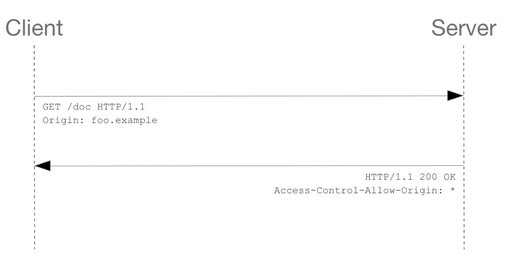
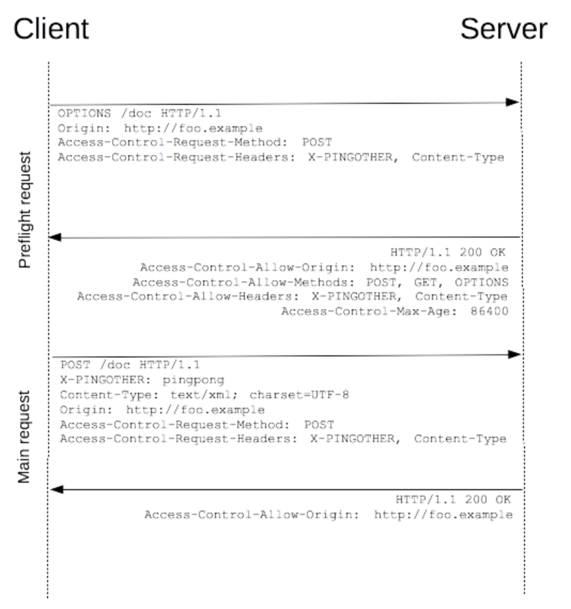
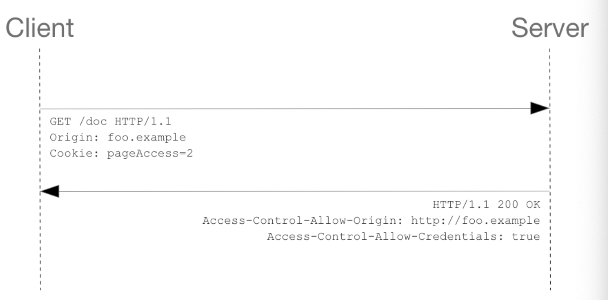

항상 로컬 머신에서 리액트 서버와 백엔드 서버를 띄우고 웹 개발을 하면, CORS에 대한 에러를 마주한다.  
이것이 뭔지 그리고 왜 사용하는지 한번 자세히 살펴보도록 하자.

## CORS의 생성 역사

기본적으로 HTTP 요청은 Cross-Site HTTP 요청이 가능하다.  
예를 들어서 ``태그로 다른 도메인의 이미지 파일을 가져오거나, `<link>` 태그를 통해 다른 도메인의 CSS를 가져오는 경우이다. 이런 경우 모두 다른 사이트에서 해당 리소스를 요청해서 가져오고, 이는 모두 제약 없이 가져올 수 있다.

하지만 `` 로 둘러싸여있는 스크립트에 생성된 요청들은 **Same Origin Policy** 를 적용 받기 때문에 Cross-Site HTTP 요청이 불가능하다.

하지만 AJAX가 널리 사용되면서 `` 로 싸여있는 스크립트에 생성되는 `XMLHttpRequest`에 대해서도 Cross-Site HTTP 요청이 가능해야 한다는 요구가 늘어났고, **CORS**라는 이름의 권고안이 나오게 되었다.

## CORS란?

**CORS**는 `Cross-Origin Resource Sharing`의 약자로, **한 출처에서 실행중인 웹 어플리케이션이 다른 출처의 선택한 자원에 접근할 수 있는 권한을 부여하도록 브라우저에 알려주는 체제**이다.  
 **CORS** 체제를 통해서 브라우저와 서버 간의 안전한 교차 출처 요청 및 데이터 전송을 지원할 수 있도록 한다.

위에서 말했듯이 **Same Origin Policy**가 적용되는 요청의 경우에는 출처(도메인, 프로토콜, 포트)가 동일한 곳에서만 리소스를 요청할 수 있다. 다음의 링크에서 예시를 확인할 수 있다.  
([어떤 요청이 CORS를 사용하나요?](https://wiki.developer.mozilla.org/ko/docs/Web/HTTP/CORS#%EC%96%B4%EB%96%A4_%EC%9A%94%EC%B2%AD%EC%9D%B4_CORS%EB%A5%BC_%EC%82%AC%EC%9A%A9%ED%95%98%EB%82%98%EC%9A%94))

하지만 이렇게 **CORS**라는 체제가 생기면서 자유자재로 자원 공유 권한을 설정할 수 있게 되었다.

## CORS의 작동 방식

**CORS**는 서버에서 어떤 origin이 이 자원에 대해서 접근를 허용하는지를 **추가 HTTP 헤더를 사용**하여 표현한다. 이 표현을 브라우저가 확인 후, 그 데이터에 대한 열람을 허용한다.

추가적으로, 서버의 데이터에 _Side Effect_ 를 가져올 수 있는 요청 메서드 (`GET`, 특정 MIME 타입의 `POST` 외 **다른 메서드**) 들에 한해서는 웹브라우저가 **Preflight Request**를 통해서 해당 method에 대해서 요청을 보낼 권한이 있는지 확인하고, 권한이 있는 경우에만 실제 요청을 보낸다.

이 과정에서 서버가 해당 요청에 대해서 **credentials** (쿠키나 HTTP Authentication) 을 필요로 하는지도 브라우저에게 알려준다.

 

**간단히 정리하자면 다음과 같다.**

1. **CORS**는 서버가 추가 헤더를 통해 자원 공유에 대한 정의를 브라우저에 보낸다.
2. **CORS**는 2개의 요청으로 정리할 수 있다. Preflight가 있는 요청과 없는 요청. (이를 Simple Request라고 한다.)
3. **Simple Request**에 대해서는 Preflight 없이 해당 요청에 대해서 Server가 어떤 Origin을 허용하는지 확인하고, 브라우저가 그 CORS에 따라서 작동을 달리한다.
4. **Preflight Request**의 경우에는 먼저 권한이 있는지 확인하기 위한 요청을 브라우저가 보낸다. 없으면 실제 요청을 안보낸다.
5. Preflight로 오는 응답에는 다양한 것들이 담기는데, 서버가 해당 method 요청에 대해서 **credentials**을 요구하는지 아닌지도 표현할 수 있다.

그렇다면, **Simple Request**일 때와 **Preflight Request**일 때의 서버와 브라우저 간의 동작 방식을 자세히 알아보자.

## Simple Request일 때의 CORS

**Simple request**의 경우에는 앞서 말한대로 preflight를 하지 않는다.  
Simple Request는 다음 조건을 모두 만족시켜야하는데, 여기에서 확인할 수 있다 -> [교차 출처 리소스 공유 (CORS) - HTTP | MDN](https://wiki.developer.mozilla.org/ko/docs/Web/HTTP/CORS#%EB%8B%A8%EC%88%9C_%EC%9A%94%EC%B2%ADSimple_requests)

Simple Request는 서버에 1번 요청, 서버도 1번 응답하는 것으로 처리가 종료 된다.
브라우저가 서버로 전송하는 내용을 살펴보고, 서버로부터의 응답을 확인해 맞게 처리해준다.

서버는 `Access-Control-Allow-Origin` 헤더를 통해, 자신이 허용하는 Cross Origin을 전부 명시한다. `*`는 전부를 허용한다는 의미이다.

## Preflight Request일 때의 CORS

**Preflight Request**는 위에서 언급한 방식이 아닌 모든 요청을 포함한다.

Preflight일 때는 총 2번의 요청을 주고 받게 된다. 하나는 예비요청, 하나는 본요청으로 구성된다.  
먼저 예비 요청을 날리는데, `OPTIONS`메서드를 통해 다른 도메인의 리소스로 HTTP 요청을 보내, 실제 요청이 가능한지, 안전한지를 확인한다.  
안전하다는 것을 추가 헤더로 확인한 이후에는,
본요청을 통해 서버에서 해당 리소스에 대한 요청을 보낸다.

위 사진에서와 같이 Preflight 요청에는 `Access-Control-Request-Method`와 `Access-Control-Request-Headers`가 포함된다. 아마 브라우저가 이러한 것들을 넣어주어 요청을 보내줄 것이다.

이에 대해서 서버는 `Access-Control-Allow-Origin`, `Access-Control-Allow-Methods`, `Access-Control-Max-Age` 등 `Access-Control-*-*` 계열의 Response Header를 적절히 선언하여 응답을 보낸다. (허용하는 메서드, 허용하는 Origin, 허용하는 헤더, 해당 preflight 응답의 캐싱시간을 알려준다.)

이를 통해 해당 요청에 대해서 해당 Origin이 허용되어있다는 것을 Preflight 요청을 통해 파악하면, 그제서야 브라우저는 본 요청을 보내고, Simple Request에서의 Response와 동일하게 `Access-Control-Allow-Origin`을 포함한 응답이 브라우저에 다시 전송되어 처리되게 된다.

이렇게 Simple Request와 Preflight Request를 구분하는 차이는 **해당 Request가 사용자의 데이터에 영향을 미칠 수 있는가**의 차이인 것 같다. (그렇다면 POST는 어떻게 가능하지..?)

## Request With Credentials

위의 CORS의 개념에 대해서 살펴보았을 때, `Credentials`과 관련된 개념이 나왔다.

이 **Credentialed Request**는 HTTP cookies와 HTTP Authentication 정보를 인식한다.  
 기본적으로 일반 Cross-site Request에서 브라우저는 자격증명을 보내지 않는다. 하지만 보안상 특정 도메인의 요청만 받아야 하는 경우에는, 자격증명을 Request로 보내게 된다. 이렇게 자격증명을 보내는 경우에는 이에 대한 CORS 설정이 필요하다.

브라우저가 요청을 보낼 때 withCredentials를 `True`로 지정하고, Cookie를 보낸다고 가정하자. 요청에는 Cookie가 포함되어 있을 것이다. 이에 대해서 Response는 Credential을 허용하는지에 대한 헤더 설정이 필요하고, 정확한 Allow Origin을 명시해야한다.

따라서,

- `Access-Control-Allow-Credentials`: True
- `Access-Control-Allow-Origin`: 서버가 접근을 허용하는 Origin

위의 두가지의 Header 설정을 Response에 지정해주어야 응답이 브라우저 단에서 거절되지 않는다.

## CORS을 위한 Requset / Response Header

위에서 계속 언급했던 것처럼 CORS는 특정 HTTP Header를 추가해줌으로서 해당 리소스에 대한 접근이 가능한지를 표시한다.

Request, Response에 따라서 설정하는 CORS 관련 Header들은 다음과 같다.

> ### HTTP Request Header

- **Origin**  
  일반 요청 혹은 Preflight 요청의 출처를 나타낸다. 요청이 시작된 서버를 나타내는 URI로, 오직 서버이름만을 포함한다. CORS 요청에는 항상 이 Origin 헤더가 포함되어 있다.

- **Access-Control-Request-Method**  
  Preflight Request에서 사용하는 헤더로, 어떤 HTTP를 실제요청에서 사용하는지 알려주기 위해 추가한다. HTTP Method가 들어간다.

- **Access-Control-Request-Headers**  
  Preflight Request에서 사용하는 헤더로, 실제 요청에서 어떤 HTTP 헤더를 사용할 것인지 추가한다.

> ### HTTP Response Header

- **Access-Control-Allow-Origin**  
  해당 서버가 어떤 리소스에 접근을 허용하는지를 나타내는 Header이다. 특정 origin이나 `*`을 명시할 수 있다. `*`이 들어가면 자격증명이 없는 요청의 경우에 모든 리소스에 접근할 수 있도록 허용한다.

- **Access-Control-Expose-Headers**  
  브라우저가 접근할 수 있는 헤더를 보여준다.

- **Access-Control-Max-Age**  
  Preflight request의 요청 결과를 캐싱할 수 있는 시간을 나타낸다. 단위는 초이다.

- **Access-Control-Allow-Credentials**  
  요청의 credentials 플래그가 true일 경우, 요청에 대한 응답을 표시할 수 있는지를 나타낸다. Preflight Request에 대한 응답의 일부로 사용할 때에는, credentials를 사용하여 실제 요청을 할 수 있는 지 나타낸다.

- **Access-Control-Allow-Methods**  
  Preflight Request에 대한 응답으로, 리소스에 접근 할 때 허용되는 메서드를 지정한다.

- **Access-Control-Allow-Headers**  
  Preflight Request에 대한 응답으로, 리소스에 접근 할 때 사용할 수 있는 HTTP 헤더를 나타낸다.

## 정리

1. **CORS**는 다른 도메인 간의 **리소스 공유**과 관련된 체계이다.
2. Request, Response에 대해서 추가 **HTTP 헤더**를 추가함으로서 CORS 설정을 할 수 있다.
3. localhost끼리의 CORS 요청을 허용하려면,해당 origin을 서버에서 허용하는 **Allow Origin**을 등록하면 해결되며, Credentials를 필요로 하는 경우 **Allow-Credentials**를 `True`로 하여 응답을 보내주면 된다.

 

 

_참고 포스팅_ :  
[CORS :: 개인적인공간](https://brownbears.tistory.com/336)  
 [교차 출처 리소스 공유 (CORS) - HTTP | MDN](https://developer.mozilla.org/ko/docs/Web/HTTP/CORS)
