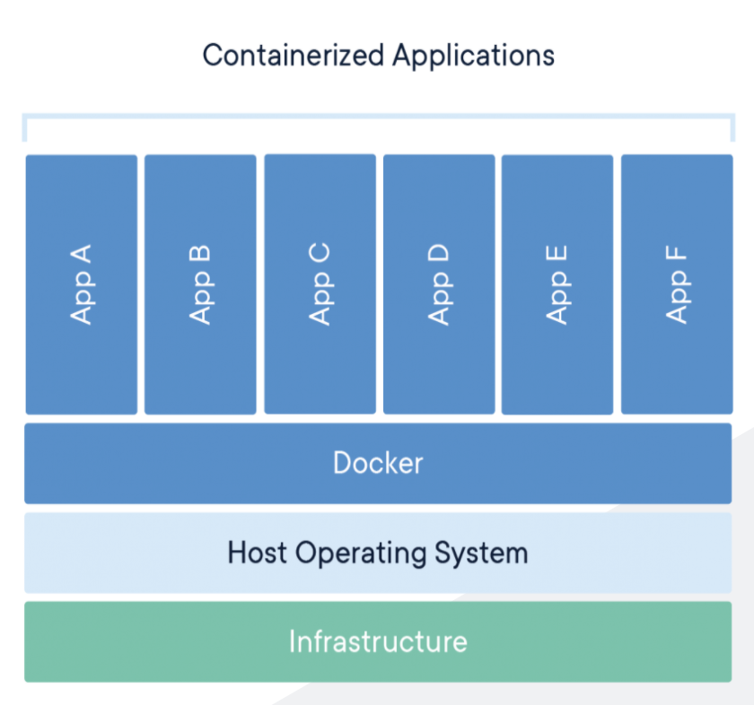
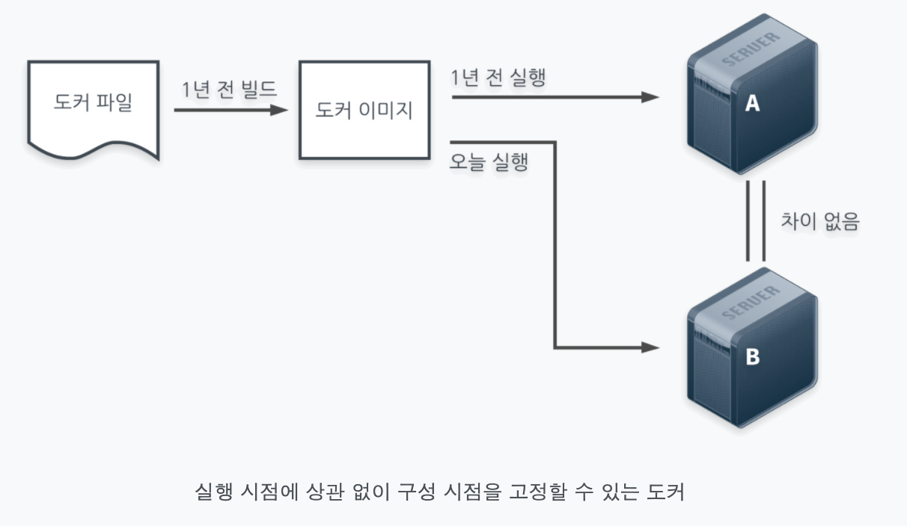

## Django를 위한 MySQL Docker로 띄워보기

Django를 위한 MySQL 자체만을 Docker로 띄워보라는 리퀘스트를 받았다.
그래서 한번 도전해보았다.

### Docker로 MySQL 띄우기

일단 docker를 설치한다.

```bash
$ brew cask install docker
```

도커를 사용하기 위해서 도커 관련 command를 살짝 정리해보았다.

```bash
$ docker ps # 현재 띄워져 있는 contanier 목록
$ docker run [OPTIONS] <image> [COMMAND] [ARG] # container 실행
# 앞에는 container에 대한 env 설정, image 뒤에는 관련 커멘드와 ARG 지정 가능
$ docker stop <container_id> # container 종료
$ docker images # 가지고 있는 이미지 리스트
```

그러면 MySQL은 어떻게 docker로서 띄울까?

일단 MySQL과 관련된 docker image와 그를 위한 docker 추가 설정들이 필요하다.
docker는 환경을 미리 캡쳐해 놓는 이미지가 있고, 이런 이미지를 공유하는 hub가 있어서, MySQL을 위한 image는 진작에 만들어져 있다.

`docker run` command를 실행할 때 mysql을 이미지로 지정해서 run을 하면 docker가 그 이미지가 존재하지 않는다는 것을 알고 해당 이미지를 허브에서 알아서 찾아와서 가지고 온다. 그런 후에 내가 적은 command에 맞게 container를 실행시킨다.

MySQL을 위해 내가 사용한 docker command는 다음과 같았다.

```bash
$ docker run -dp 3306:3306 -e MYSQL_ROOT_PASSWORD=<password> -e MYSQL_DATABASE=<database_name> mysql
```

`-dp` 예약어는 `-d`와 `-p`를 합쳐 적은 것이다.
`-d`는 해당 container를 백그라운드로 실행하는 것이며, `-p`는 port에 관한 설정이다. 해당 컨테이너가 외부와 통신하기 위해서는 port를 열어놓아야 하는데, 그 포트 번호를 적을 수 있다. 3306:3306의 의미는 host의 3306 포트에 요청이 들어오면, container의 3306 포트에 forwarding 하겠다는 의미라고 한다.

`-e`는 해당 컨테이너의 환경변수 설정으로, export 다음에 넣는 환경변수와 그 값을 넣으면 해당 container에 그 환경변수가 setting이 된다.
기본적으로 `MYSQL_ROOT_PASSWORD`를 세팅해줘야하고, 나는 mysql을 컨테이너로 띄울 때 기본적으로 Django에서 사용하는 database를 가지고 있게 하고 싶었기 때문에 `MYSQL_DATABASE`라는 환경 변수를 통해서 그것을 가능하도록 해주었다.

### Host에 있는 Django를 Container의 MySQL과 연결하기

이렇게 docker를 띄운다면, 이제 내 host에 띄워져있는 Django project와 어떻게 연결할까?

그러기 이전에 나는 mysql 커맨드를 이용해서 host에 띄워져 있는 bash를 이용해 컨테이너의 mysql에 접속해보았다.

```bash
mysql -uroot --protocol=tcp -h 127.0.0.1 -p
```

위와 같은 커맨드를 입력해야 container의 mysql과 연결할 수 있다고 한다.
기본적으로 mysql은 UNIX socket을 이용해서 DB와 connection을 맺는다고 한다. 그래서 protocol을 TCP로 바꿔주고, `localhost` 라는 hostname말고 `127.0.0.1`의 ip를 직접 host로 설정해주어야 container의 mysql에 접속할 수 있다.

Django에서도 이는 동일하기 때문에 DB_HOST의 기본 값을 `127.0.0.1`로 바꾸어주면 자동으로 container의 mysql와 연결된다.

신기하게도 host에서 mysql을 3306 포트로 키면 Django든 mysql command든 가장 먼저 host의 mysql로 가장 먼저 접속한다. 해당 host를 끄면 그 다음으로 container의 mysql로 접속이 되는 현상을 발견할 수 있다. 이와 같은 일은 어떻게 일어나는지 Docker의 네트워크와 관련해서 좀 더 살펴봐야 할 것 같다.

이렇게 연결을 해보는 과정에서 Docker에 대해서 자세히 알아보고자 Docker에 대해서 검색하고 정리해보았다.

## Docker란?

일단 모든 물음에는 2가지가 필요하다. 이게 뭔지? 그리고 이게 왜 있는지?

### 이게 뭘까?

보통 우리가 한 환경에 다른 가상환경을 올릴때는 가상머신이라는 것을 이용한다.
해당 환경에서 새로 올린 가상머신은 그것만의 OS를 가지고, 그것만의 메모리 공간, 하드디스크를 따로 할당받아 해당 host 컴퓨터에서는 가상 머신(guest)을 프로세스 처럼 여기고, 가상머신은 자신이 독자적인 컴퓨터라고 생각한다. (약간은 트루먼쇼같은 느낌?)

어찌되었든 이렇게 완전히 새로운 OS를 가진 가상머신을 올리는 것은 굉장히 헤비하고, 느리다. 환경을 분리하되, 독자적으로 돌아갈 수 있도록 하는 다른 방법이 없을까?

바로 Docker가 그런 것이다. 도커는 어느 플랫폼에서나 재현가능한 어플리케이션 컨테이너를 만들어주는 가상화 어플리케이션이다.



이 Docker에서는 컨테이너라는 독특한 개념과 함께 시작한다. Docker는 각각의 VM이 아닌 Container를 띄워서 격리된 환경을 만들어준다.

아래는 Docker 소개 페이지에 나와있는 Container와 VM의 정의이다.

> VIRTUAL MACHINES

_Virtual machines (VMs) are an abstraction of physical hardware turning one server into many servers. The hypervisor allows multiple VMs to run on a single machine. Each VM includes a full copy of an operating system, the application, necessary binaries and libraries - taking up tens of GBs. VMs can also be slow to boot._

VM은 한 서버를 여러 서버로 바꾸어주는 물리적 하드웨어의 추상화를 말한다. 하이퍼바이저가 여러개의 VM이 한 머신에서 돌 수 있도록 만들어준다. 각각의 VM은 OS의 full copy와 application, 바이너리와 라이브러리를 가지고 있다. 부팅 속도도 매우 느리다.

> Container

_Containers are an abstraction at the app layer that packages code and dependencies together. Multiple containers can run on the same machine and share the OS kernel with other containers, each running as isolated processes in user space. Containers take up less space than VMs (container images are typically tens of MBs in size), can handle more applications and require fewer VMs and Operating systems._

Container는 app layer에서 코드와 그와 관련한 의존성을 packaging하는 추상화이다. 여러개의 컨테이너한 하나의 머신에서 돌아가고, OS 커널을 다른 머신과 공유한다. 각 프로세스는 유저 space에서 독립적으로 실행된다. 컨테이너는 VM보다 적은 공간을 찾이하고, 많은 application을 핸들링할 수 있으며, 적은 Vm과 OS를 필요로 한다.

저 위의 그림을 기반으로 하면 조금 더 Container에 대한 이해가 잘 되는 것 같다.

### 왜 쓰는 걸까?

도커 컨테이너는 어플리케이션의 환경에 구애받지 않고 해당 어플리케이션을 작동시킬 수 있게 만든다. 어떤 OS를 쓰느냐에 따라서 특정 command를 사용해야하는데, container를 사용하면 도커에서 사용하는 command를 이용하여 필요한 것들을 설치하거나 기동하도록 할 수 있다.

서버를 운영하다보면, 서버를 다루는 기술과는 별개로 서버마다 운영기록이 달라지게 된다. 같은 일을 하는 서버라도, 운영체제부터 컴파일러, 설치된 패키지까지 완벽히 같을 수는 없다. 이렇게 서로 모양이 다른 서버가 존재하는 상황을 `눈송이 서버`라고도 한다.

이런 눈송이 서버가 많은 상황에서는 같은 application을 설치하거나 할때 발생하는 충돌을 빠르게 파악하기 쉽지 않다.
그렇기 떄문에 다양한 방식으로 이런 서버의 `운영기록`을 저장해두곤 한다. 예를들어 사내 문서 도구에 기록을 해둔다거나 `tmux-xpanes`와 같은 도구를 이용해서 여러 서버에 동시에 접속해 한꺼번에 명령을 실행함으로서 모든 서버의 운영기록을 동일하게 맞춘다.
하지만 이대로 하더라도 잘 안되는 경우도 생기고, 한번에 여러 서버를 조작하더라도 특정 한 서버만 문제가 생기는 경우가 허다하다. 그런 상황에서 운영 기록을 `코드화`하려는 다양한 시도들이 등장한다.

베이그런트(Vagrant)나 셰프(Chef), 앤서블(Ansible)와 같은 환경 자동화 도구 등에서는 운영 기록을 코드화하고, 다시 그 운영 기록을 후에도 재현하려는 의도가 담겨있다.

도커파일도 이와 같이 서버의 운영기록을 코드화한 것이다.
도커 파일을 이용해서 도커 이미지를 만들 수 있다. 도커 파일이 서버 운영 기록이라면, 이미지는 그 운영 기록을 `실행할 시점`이 된다.

따라서 이런 도커 파일과 도커 이미지를 잘 활용하면, 그 도커 파일로 만들어놓은 도커 이미지를 통해 시간에 구애받지 않고 같은 서버 환경을 언제든지 만들 수 있다.



이것이 바로 도커가 다른 서버 구성 도구와 가장 다른 부분이다. 다른 도구들은 전부 도구를 실행하는 시점에 서버의 상태가 결졍되는 반면에, 도커는 `작업자가 그 시점을 미리 정해 둘 수 있다.` 그래서 항상 서버를 똑같은 상태로 만들 수 있는 것이다.

이렇게 도커 이미지를 통해서 그 시점에 내가 만들어 놓은 서버 상태를 그대로 유지한, 도커 컨테이너를 띄울 수 있고 해당 컨테이너를 통해 안정적으로 서비스를 운용할 수 있다.

아래의 글을 계속 보면 도커를 사용해야하는 이유를 TDD와 엮어서 설명한다. 이건 후에 필요할 때 읽어보면 좋을 것 같다.

그리고 추가적으로 도커 이미지와 컨테이너의 차이 또한 설명되어 있으므로 참고하면 좋다.

[왜 굳이 도커(컨테이너)를 써야 하나요? - 컨테이너를 사용해야 하는 이유 | 44BITS](https://www.44bits.io/ko/post/why-should-i-use-docker-container)

<br>
<hr>
<br>

따로 보고 정리하고 싶은 내용들  
[Docker Network 구조(3) - container 외부 통신 구조](https://bluese05.tistory.com/53)
