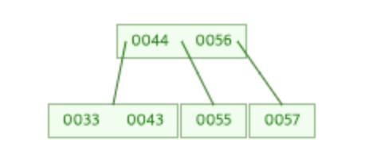
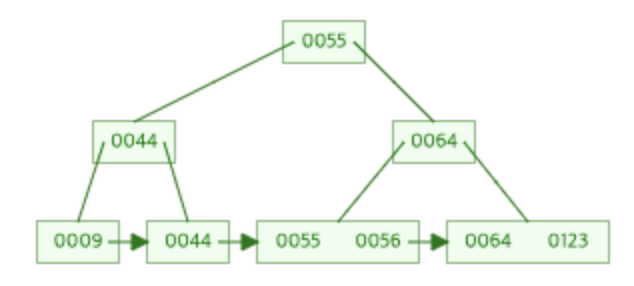

오늘은 면접 질문을 준비하면서 예전 면접에서 답하지 못했던 내용, 내가 말로는 알고 있지만 진짜로 이해하지 못했던 부분을 정리해나갔다. 그런 과정에서 정리하고 싶은 내용을 오늘의 TIL로 남겨본다.

## B tree와 B+ tree

DB에서 인덱스를 구성하는 자료구조로 가장 기본적으로 사용하는 것이 바로 B tree이다.
이 B tree가 어떤 구조이고, 어떻게 삽입, 삭제를 하기에 효율적인지, 그리고 B tree와 B+ tree의 차이를 알아보도록 하자.

일단 B tree를 알기 전에 먼저 알아야 하는 자료 구조가 있다. 한번 그를 차근차근 살펴보자.

> ### 2-node, 3-node ... n-node

기본적으로 우리가 알고 있는 tree의 node는 하나의 key를 가지고 0개 이상을 가지는 것이라고 알고 있다. 하지만 node의 key는 여러개가 될 수 있으며, 그러한 노드들을 이름 붙여 정의해놓았다.

**2-Node**는 key가 1개, 그리고 그 child node가 2개인 노드 구성을 일컽는다. 그리고, **3-Node**는 key가 2개, 그리고 그 child node가 2개인 노드 구성을 말한다.

 2-Node
 3-Node

그리고 **n-Node** 는 key가 n-1개, child node가 n개인 노드를 말한다.

> ### 2-3 tree

위에서 설명한 2-Node와 3-Node의 형태인 node가 이루어진 트리가 있는데, 그것이 바로 **2-3 tree**이다. 그리고 2-3 tree는 균형트리라는 속성을 가진다. 이 조건 때문에 삽입 삭제가 특이하다.

#### 1. 삽입

2-3 트리의 삽입은 일단 기본적으로 맞는 위치를 탐색하고, 해당 노드가 삽입될 노드를 찾는다.

이렇게 삽입될 노드를 찾으면, 그 삽입될 노드가 어떤 상태인지에 따라 동작이 달라진다.

- **삽입될 노드가 2-Node인 경우**, 단순히 해당 노드에 삽입할 값을 추가해 3-Node로 변경해준다.

- **삽입될 노드가 3-Node인 경우**, 해당 노드에 삽입 될 값을 추가해 4-Node로 일시적으로 만든 후, 노드가 저장하는 3개 key 중에 가운데 값을 부모 노드로 이동 시켜 해당 노드를 다시 3-Node로 수정하고 부모 노드도 3-Node로 수정한다.

- **삽입될 노드, 그리고 그 부모노드도 전부 3-Node인 경우**, 2번째와 유사하고, 대신 2-Node인 부모노드가 나올 때까지 계속 2번을 반복한다. 만약 Root Node가 3-Node라면, Root Node의 가운데 key 값으로 Root노드를 생성하고 기존 Root 노드에 남은 두개의 키값으로 자식 노드를 생성하면 된다.

그림을 통해서 더 자세히 알아보면 다음과 같다.

위의 사진과 같은 트리가 존재한다고 할 때, 여기서 58이라는 수를 삽입한다면 추가하는 해당 노드는 **57**일 것이다. 이는 **첫번째 경우**이기 때문에 단순히 (57, 58)의 3-Node가 형성된다.

만약에 35를 삽입한다면 어떨까? 이는 **3번째의 경우**에 해당한다. 35가 들어가야할 노드는 **(33, 43)** 노드일 것이다. 일단 (33, 35, 43) 형태의 4-Node가 만들어질 것이고, 중간 값인 35가 부모의 Node로 들어가게 될 것이다. 그러면 Root Node 또한 4-Node가 된다. Root Node에서는 중간 값인 44 를 key로 하고, 35와 56을 child node로 하는 2-Node가 생성될 것이다.

#### 2. 삭제

삭제는 일단 2가지의 요소가 중요하다. 해당 노드를 삭제했을 때, 균형트리가 유지 되는지, 그리고 노드를 삭제할 때 key가 사라지는 Empty Node가 없는지이다. 삭제 후에 이러한 요소가 만족할 때까지 특정 작업을 한다.

삭제는 너무 복잡해서 직접 설명을 작성할 엄두가 안난다... 추가적으로 후에 보강해야겠다. 더 나은 설명이 필요한 분은 아래 포스팅을 참고하면 될 것 같다.

> ### B Tree?

그래서 B Tree는 뭐냐고?  
위에서 살펴본 2-3 Tree도 B Tree의 일종이다. 위처럼 N-Node의 형태를 가지는 Tree를 B Tree라고 하고, 2-3 Tree는 2차 B-Tree라고 말한다. 차수에 들어가는 것은 하나의 노드가 가질 수 있는 데이터의 수를 말한다.

다시 정리하자면, **2-3 Tree는 2차 B-Tree**가 된다.

> ### B+ Tree?

B Tree는 특성상 순회 작업이 매우 난감하다. 모든 tree의 노드를 방문해야하기 때문이다. 이런 순회 작업의 복잡성에 대한 문제를 해결하기 위해 제시된 것이 **B+ Tree**이다.

B+ Tree는 모든 데이터는 **leaf 노드**에 존재한다. 그리고 탐색을 위한 key값이 되는 Node들은 중복으로 **Non-leaf 노드**를 구성하게 된다. 즉, 값을 찾기 위한 **인덱스 노드**와 실제로 그 값을 가지고 있는 위한 **리프 노드**가 분리되어서 존재하는 것이다.  
그리고, 각 leaf node들은 전부 linked list로 연결되어 있어 순차 처리가 가능하다.

> ### B+ Tree의 장단점

앞서 말했던 것처럼, 데이터에 대한 순차 순회에 대해서는 매우 큰 강점을 지닌다. 하지만 Search를 하는 경우에 B Tree는 빠르면 Root에서 끝날 수 있지만, B+ Tree는 무조건 Leaf Node까지 다다라야한다는 단점이 있다. Key가 담고 있는 실제 데이터는 아래의 Leaf Node가 갖고 있기 때문이다.

_참고 포스팅_

[2-3 tree](https://everycodeisanenigma.blogspot.com/2019/05/2-3-tree-red-black-binary-search-tree.html)
[B tree](https://hyungjoon6876.github.io/jlog/2018/07/20/btree.html)
