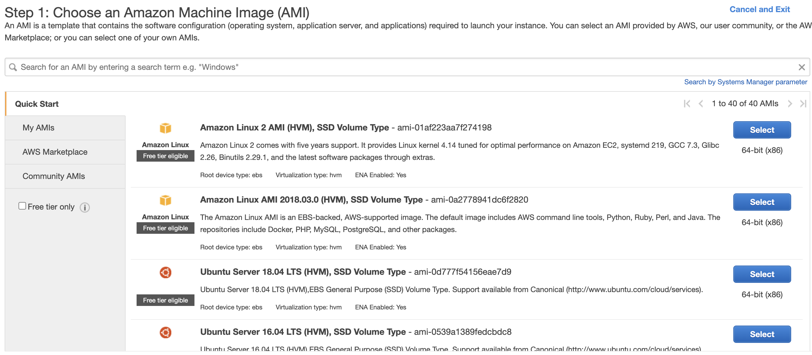
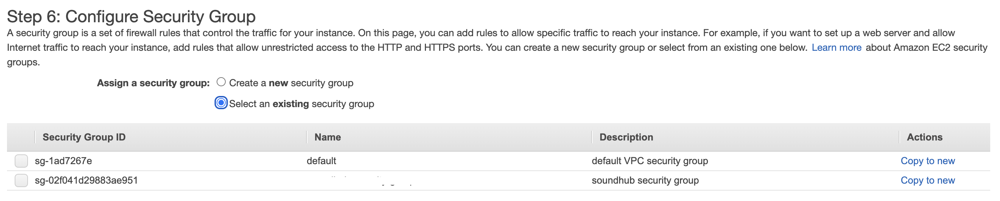
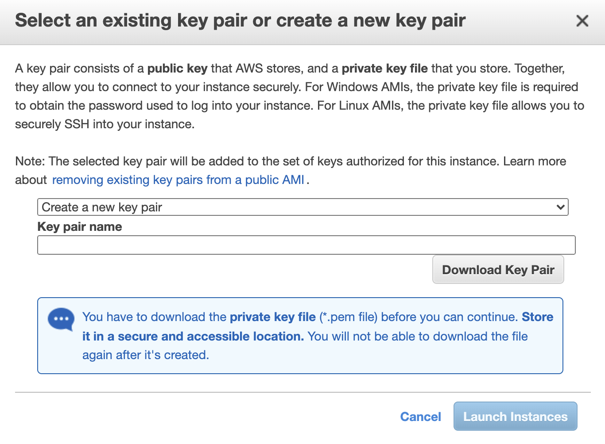
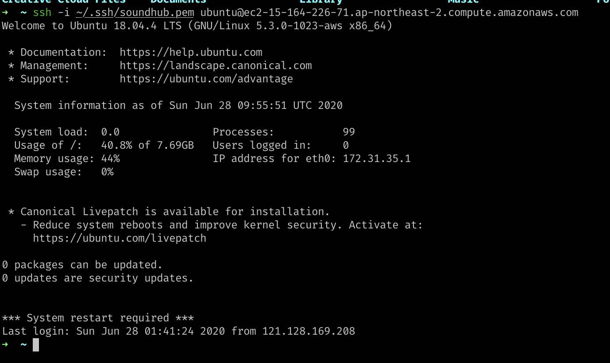

오늘은 개발한 서비스를 EC2를 이용하여 배포를 해보았다. AWS를 이용해서 배포하는 것은 처음이여서 그에 대해서 한번 알아보려고 한다.

나는 EC2를 사용해서 일단 backend 웹 서버만 배포를 시도했다.

`사용자 <-> Nginx 웹서버 <-> uWSGI <-> Django`

위의 구조로 서버에 설정을 해주어야 한다.  
여기서 Nginx는 **웹 서버(Web Server)** 이고 uWSGI는 **웹 서버 게이트웨이 인터페이스(Web Server Gateway Interface)**라고 해서, 웹 서버와 웹 어플리케이션 간의 연결을 해주는 인터페이스라고 할 수 있다.

유저가 해당 도메인에게 요청을 날리면, 그 도메인과 연결된 서버가 그 요청을 받게 된다. 실질적으로 해당 컴퓨터 안에서 돌아가는 웹서버가 그 요청을 받게 되는 것이다.

웹 서버가 요청을 받으면 그 요청에 맞추어 일을 처리해주는 코드가 필요하다. 그것은 바로 우리가 구현한 웹 어플리케이션이며, 그 사이에 request를 주고받을 수 있도록 중개 역할을 해주는 친구가 **WSGI**이다.

원래는 Django는 runserver 커맨드를 이용해서 외부 요청을 받아왔다면, 이러한 역할을 대신 해주는 것이 바로 WSGI라고 한다. runserver는 개발용으로 돌리는 서버여서 성능이 좋지 않다고 한다.

어찌되었든 이렇게 어느정도 이해했으니 실질적으로 하나하나 세팅을 해보도록 하자.

## AWS Resource 구축하기

일단 웹서버를 띄울 가상 서버가 필요할 것이다. 그는 AWS EC2를 이용해서 배포를 시도해보자.



EC2 리소스 페이지에 들어가서 `Launch Instance`를 누르면 어떤 운영체제를 이용해서 서비스를 올릴지가 나온다. 나는 무난하고 익숙한 우분투 서버를 골랐다. 추가로 인스턴스 타입 또한 내가 고를 수 있는 프리 티어의 인스턴스 타입을 골랐다. 서브넷이나 네트워크 VPC는 이 인스턴스를 만들 때 새로 생성해주었다.

<br>



후에 추가적으로 설정할 것은 `Security Group`이다. 이는 내가 생성해놓은 모든 컴퓨팅 자원들에 대해서 어떤 IP에 접근을 허용할 것인지, 어떤 IP 레이어에 서비스 응답을 보내줄 것인지 등의 Inbound와 OutBound를 설정해주는 것을 주로 할 수 있는데, 이는 중요하니 이름을 붙여서 따로 만들도록 하자. 서비스를 만들기 이전에 EC2의 **Network & Security** 탭에서 이를 새로 생성할 수 있다.

<br>



이제 생성이 다 완성이 되면 이러한 창이 뜨게 된다. 지금 생성하게 되는 자원은 EC2 서비스에서 인스턴스에 접근할 수 있는 권한을 얻을 수 있는 `Key Pair`이다. 이 key pair를 생성하면 `.pem` 파일이나 `.ppk` 파일을 얻을 수 있는데, 이를 통해서 EC2 인스턴스에 ssh나 putty로 접속할 수 있다. 컴퓨터에 저장해놓고,
이래의 커맨드로 권한을 설정해 소유주만 읽을 수 있도록 해준다.

```bash
chmod 400 pem파일
```

## EC2 인스턴스에 접속하기

이렇게 EC2를 설정해서 서비스를 만들면, `Running Instance` 탭에서 내 인스턴스가 initializing 되는 것을 확인할 수 있다. 그리고 나서 온전히 서비스가 올라가면, 이제 해당 서비스에 접근 할 수 있다.

아까 다운받은 키페어와 함께, ssh 커맨드를 이용해서 이와 같이 접속해 준다.

```bash
ssh -i 키페어경로 사용자명@EC2publicDNS주소
```

해당 인스턴스의 사용자명은 `ubuntu`로 자동으로 생성되며, public DNS 주소는 인스턴스 관리화면에서 가져올 수 있다.

<br>



이렇게 하면 이제 EC2 instance에 접속이 된다.

## 가상서버 초기 환경설정하기

### Locale 설정

이렇게 가상서버를 들어가면 제일 먼저 해야할 것이 `locale`을 설정하는 것이다.

`locale` 커맨드를 통해서 해당 우분투 서버의 Locale들을 확인할 수 있다.

```bash
LANG=C.UTF-8
LANGUAGE=
LC_CTYPE="C.UTF-8"
LC_NUMERIC="C.UTF-8"
LC_TIME="C.UTF-8"
LC_COLLATE="C.UTF-8"
LC_MONETARY="C.UTF-8"
LC_MESSAGES="C.UTF-8"
LC_PAPER="C.UTF-8"
LC_NAME="C.UTF-8"
LC_ADDRESS="C.UTF-8"
LC_TELEPHONE="C.UTF-8"
LC_MEASUREMENT="C.UTF-8"
LC_IDENTIFICATION="C.UTF-8"
LC_ALL=
```

이것이 초기 설정되어있는 서버의 Locale이다. 다음 커맨드를 이용해서 locale를 아래와 같이 바꾸어주자.

```bash
sudo vi /etc/default/locale

# 다음과 같이 설정

LC_CTYPE=en_US.UTF-8
LC_ALL=en_US.UTF-8
LANG=en_US.UTF-8
```

저장한 후 다시 재접속하면 locale이 새로 적용된다.

### 기본 설정

`apt-get` command를 위해서 이를 전부 업데이트 해준다.

```bash
sudo apt-get update
sudo apt-get dist-upgrade
```

중간에 이상한 화면이 나온다면, 그냥 원 상태 그대로 엔터를 쳐주면 된다.

추가적으로 python과 편한 bash를 위해 zsh도 깔아서 설정해주자.

```bash

sudo apt-get install python-pipsudo
apt-get install zshsudo curl -L http://install.ohmyz.sh | sh
sudo chsh ubuntu -s /usr/bin/zsh

# 위의 커맨드를 실행한 후 다시 켜주면 zsh이 적용된다.
```

아래는 추가적으로 해야할 것들인데 아직 정리가 되지 않았다. 차근차근 정리하려고 한다.

- pyenv 맞는 버전 다운 및 프로젝트 환경에 맞는 virtualenv 설정
- spc command를 이용해서 project 폴더 그대로 가상 머신 내로 이동 (그 전에 해당 폴더에 대해서 해당 유저의 권한을 설정해주어야 함 chown … )
- poetry 설치, 해당 위치에 dependency 설치 …

내용들이 길고 복잡해서 나중에 포스팅으로 정리하는 것이 좋을 것 같다.

_참고 포스팅_
[Deploy Django 프로젝트 배포하기](https://nachwon.github.io/django-deploy-1-aws/)
