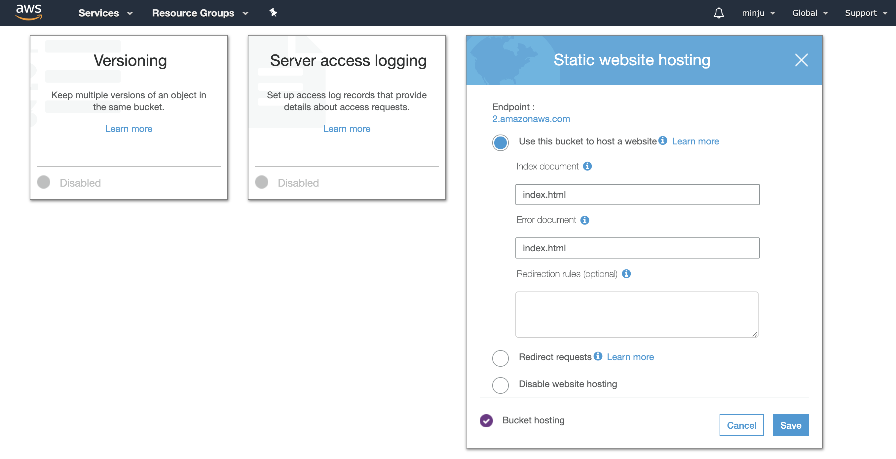
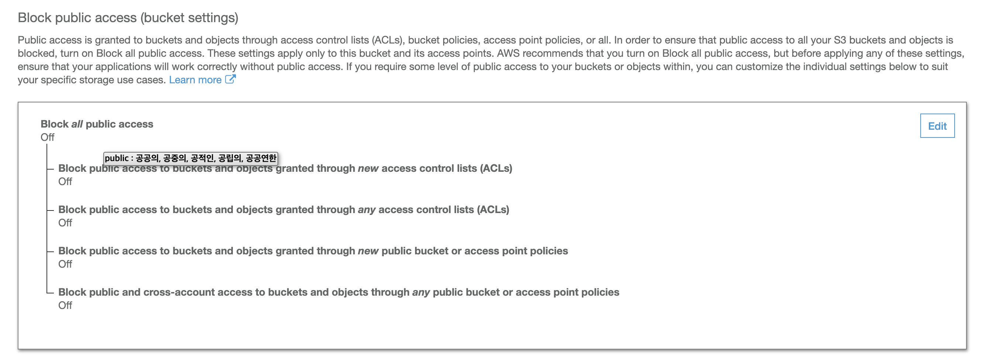
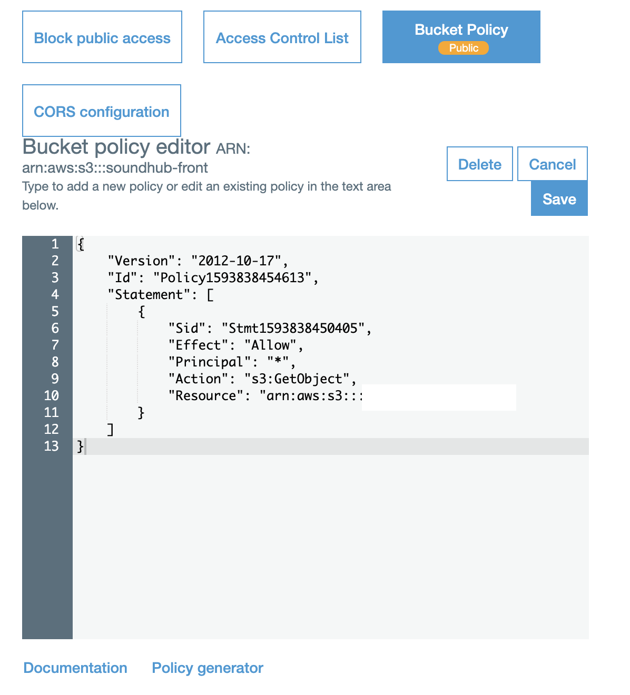
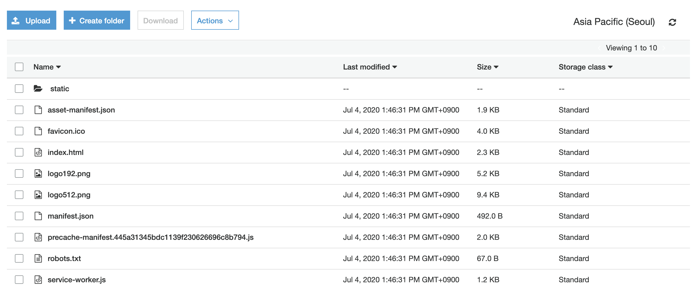

## React S3로 배포하기

오늘은 직접 React를 S3로 배포하는 것을 해보았다.
React 서버를 EC2로 배포할 수도 있지만, 앱이 커짐에 따라 빌드되는 앱의 크기가 커지므로 S3로 배포를 많이 한다고 한다.

정말 친절하게 잘 설명이 되어있는 포스팅이 많아서 참고해서 배포를 진행했다.

 

일단 로직은 이러하다.

**1. 만든 React App을 빌드해서 Static 한 build 파일을 만든다.**

**2. S3 버킷을 하나 판다.**

**3. 해당 S3를 호스팅용 버킷으로 만든다.**

이런 식으로 S3버킷 설정중에 호스팅용 버킷 설정이 있는데, 설정해주면 저 화면에 나와있는 DNS 주소로 해당 페이지를 접근할 수 있다.

**4. 추가적인 설정을 해준다.**

- Public Access 변경

호스팅용 버킷이기 때문에, 모든 access를 public access로 변경해주어야 한다.

- Bucket Policy 변경

또한, 이 bucket에 대한 policy를 추가해주어야 한다. Bucket Policy 탭에 들어가면, Policy generator로 이 Policy를 생성할 수 있는데, 아래 참고 포스팅을 보면 쉽게 설정할 수 있다. 그냥 복사 붙여넣기로 Policy를 추가해주면 된다.

**5. build한 React 파일을 bucket에 넣어준다.**

build 폴더 자체를 넣는 것이 아니라, 아래처럼 build 폴더 안의 파일들을 그대로 옮겨주면 된다.

**6. 그러면 끝!**

해당 DNS를 통해서 들어가면 build한 react app을 확인할 수 있다!!!

다음번에는 **github action**을 이용해서 s3로 자동배포하는 방법을 적용해볼 예정이다 :smile:

 

 

_참고 포스팅_  
[AWS S3 - React app 배포하기](https://youwaytogo.tistory.com/58)
