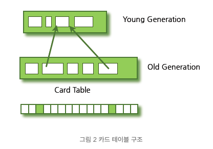

## Garbage Collector

JVM의 Garbage Collector는 Heap 영역에 생성된 메모리가 Stack을 통해 도달하지 못하는 상황에 Heap 메모리를 정리해준다. 이러한 메모리는 **Unreachable Memory**라고 한다.

또한, Java의 gc 과정에 있어서 매우 중요한 개념이 있다. 그것은 바로 `stop the world`이다.

### Stop the World

: GC를 실행하기 위해 JVM이 application 실행을 멈추는 것. Stop the world가 발행하면 GC를 실행하는 쓰레드 외의 나머지 쓰레드는 모두 작업을 멈춘다.
어떤 GC를 사용하더라도 이 Stop the Word는 발생하는데, 대개의 경우 GC 튜닝이란 Stop the World의 시간을 줄이는 것이라고 한다.

GC에는 다양한 알고리즘이 존재하는데, 기본적인 Java Garbage Collection에 대해서 정리해보려고 한다. 또한, 가장 일반적인 JVM인 Hotspot JVM의 GC 과정에 대해서 알아보도록 하자.

## GC의 과정

기본적으로 C와 같은 언어는 개발자가 직접 메모리에 대해 `free()`를 해야하지만, java는 스스로 쓰지 않는 메모리에 대해서 deallocating을 해준다. 아주 기본적인 automatic gc의 동작은 다음과 같다.

1. Marking  
   사용하지 않는 메모리를 표시한다.

2. Normal Deletion  
   사용하지 않는 메모리를 지운다.

3. Deletion with compaction  
   쓰지 않는 메모리를 지움과 동시에, 퍼포먼스를 위해 메모리에 대한compaction 과정을 거친다. 레퍼런스 되어있는 object 위치를 같이 옮김으로써, 새로운 메모리 할당을 더 빠르고 쉽도록 만든다.

## Hotspot JVM Garbage Collection

java에서는 프로그램 코드에서 명시적으로 가비지 콜렉팅을 하지 않는다. `System.gc()`를 불러서 명시적으로 해제를 할 수 있지만, 이는 시스템 성능에 큰 영향을 끼치므로 절대 사용하면 안된다고 한다.

따라서 가비지 컬렉터는 자신이 스스로 알아서 가비지 콜렉팅을 한다.
가비지 컬랙터는 다음 두가지 가설을 기반으로 만들어졌다.

    1. 대부분의 객체는 빠르게 unreachable하게 된다.
    2. 오래된 객체에서 젊은 객체로의 참조는 아주 적게 존재한다.

이러한 가설을 `Weak Generational Hypothesis` 라고 한다. 이러한 장점을 살리기 위해서 힙 공간을 크게 **Young**과 **Old**라는 두개의 공간으로 나눈다.

- Young 영역: 새로 생성된 객체가 위치하는 곳. 많은 객체가 이 레벨에서 사라지는데, 이때 **Minor GC**가 발생한다고 말한다.
- Old 영역: 접근 불가 상태가 되지 않아 Young영역에 살아남은 객체가 여기에 존재한다. Young영역보다 크게 할당하며, 크기가 큰 만큼 GC가 적게 발생한다. 이 영역에서 객체가 사라질 때 **Major GC**가 발생한다고 말한다.
- Permanent 영역: JVM에서 application에서 사용하는 클래스와 메서드를 표현하기 위한 metadata를 담는다. Java SE library 클래스도 여기에 담긴다. 이 영역에 대한 GC도 Major GC에 포함된다.

보통 Major GC가 일어나는 속도가 더 느린데, 그 이유는 모든 살아있는 객체들이 GC 판단의 대상에 전부 포함되기 때문이다.  
따라서 반응성이 높은 application에 대해서는 이러한 major gc를 최소화하는 작업이 필요하다. 또한, major gc를 위해 일어나는 `Stop the World` 의 길이는 old generation space에 사용되는 garbage collector의 종류에 영향을 받는다.

Old 영역의 객체가 Young 영역의 객체를 참조하는 경우도 있기는 있다. 그 경우를 위해서 Old 영역에는 512바이트의 덩어리(chunk)로 되어 있는 카드 테이블(card table)이 존재한다.

카드 테이블에는 Old 영역에 있는 객체가 Young 영역의 객체를 참조할 때마다 정보가 표시된다.  
Young 영역의 GC를 실행할 때에는 Old 영역에 있는 모든 객체의 참조를 확인하지 않고, 이 카드 테이블만 뒤져서 GC 대상인지 식별한다.

### Young 영역의 구성

3개의 구성으로 이루어져 있다. - Eden 영역 - Survivor 영역 (2개)

그리고 객체가 생성되고 다음과 같은 과정을 거친다.

1.  객체 생성시 Eden 영역에 생성
2.  Eden 영역이 다 차면 비어져 있지 않은 Survivor 영역에 옮겨짐 with promotion
3.  하나의 Survivor 영역이 다 차게 되면, 이 중 살아남은 객체를 다른 Survivor 영역으로 이동시킴. 가득찬 Survivor 영역은 비어지게 됨.
4.  이 과정을 반복, 어느정도 살아남은 객체 (특정 level에 도달하면)는 Old 영역으로 이동함

이 과정을 미루어 보았을 때, 항상 2개의 Survivor 영역 중 하나는 비어있게 된다.  
Promotion은 GC를 하는 과정에서 계속 살아있는 객체가 다른 공간으로 이동할 때 aging이 되도록 한다.

HotSpot VM에서는 빠른 메모리 할당을 위해 `bump-the-pointer`와 `TLABs`라는 기술을 사용한다고 한다.  
이는 추가로 이 글을 참고하면 좋을 것 같다.  
[NAVER D2](https://d2.naver.com/helloworld/1329)

### Old 영역에 대한 GC

이 Old 영역에 대한 GC가 중요한데, 이에 대한 방식은 JDK 7 기준으로 5가지 방식이 있다.

#### Serial GC

운영서버에서는 절대 사용하면 안되는 방식. CPU 코어가 하나만 있을 때 사용하기 위해 만든 방식.
`mark-sweep-compact` 알고리즘을 사용하는데, 앞서서 설명한 기본적인 gc 방식때로 진행한다.

#### Parallel GC

Serial과 기본 골자 알고리즘은 같다. 하지만 GC를 실행하는 Thread가 여러개이다. 따라서 빠르게 객체를 처리할 수 있다. 이 GC는 메모리가 충분하고 코어의 개수가 많을 때 유리하다. Throughput GC라고도 불린다.

#### Parallel Old GC(Parallel Compacting GC)

Parallel GC와 Old 영역의 GC 방식만 다르다. `mark-summary-compaction` 과정을 거친다. Summary에서는 앞서 GC를 수행한 영역에 대해서 별도로 살아있는 객체를 식별한다는 점에서 Sweep과는 다르고, 좀 더 복잡한 단계를 거친다.

#### Concurrent Mark & Sweep GC(이하 CMS)

좀 더 복잡하다.

CMS는 객체를 마킹하는 과정에 Tri-color Marking Algorithm을 사용한다. 기존의 Mark and Sweep 과는 다른 차이점을 지닌다.

1. Initial Marking
   클래스 로더에서 가장 가까운 객체 = 스택에서 참조하고 있는 객체인데,
   그걸 먼저 훑는다. (그래서 이 때 Stop The World가 일어난다.)

2. Concurrent Marking
   그 이후에 Tri-color Marking Algorithm을 이용해 root로 부터 참조되고 있는 객체들에 마킹을 한다. 이를 Concurrent Marking이라고 한다. (이는 실행과 병렬적으로 일어난다.)

3. Remark
   그 다음 Remark 단계에서는 Concurrent Mark단계에서 끊기거나 새로 추가된 객체를 확인한다. 이 때 또 한번 STW 이벤트가 발생한다.

4. Concurrent Sweep
   마지막으로 Concurrent Sweep 단계에서 쓰레기를 정리하는 작업을 실행한다. 이 작업도 다른 스레드가 실행되고 있는 상황에 진행된다.

Trim-color Algorithm은 이걸 읽으면 더 이해가 잘간다.  
[(JVM) Garbage Collection Advanced | 오늘도 끄적끄적](https://perfectacle.github.io/2019/05/11/jvm-gc-advanced/)

이러한 단계로 진행되는 GC 방식이기 때문에 stop-the-world 시간이 매우 짧다. 모든 애플리케이션의 응답 속도가 매우 중요할 때 CMS GC를 사용하며, Low Latency GC라고도 부른다.

그런데 CMS GC는 stop-the-world 시간이 짧다는 장점에 반해 다음과 같은 단점이 존재한다.

- 다른 GC 방식보다 메모리와 CPU를 더 많이 사용한다.
- Compaction 단계가 기본적으로 제공되지 않는다.

따라서, CMS GC를 사용할 때에는 신중히 검토한 후에 사용해야 한다.  
그리고 조각난 메모리가 많아 Compaction 작업을 실행하면 다른 GC 방식의 stop-the-world 시간보다 stop-the-world 시간이 더 길기 때문에 Compaction 작업이 얼마나 자주, 오랫동안 수행되는지 확인해야 한다.

## G1(Garbage First) GC

G1 GC는 큰 메모리를 가진 멀티 프로세서 머신을 위해 만들어진 GC이다. 또한 CMS GC를 대체하기 위해 만들어진 GC이다.  
CMS와 비교했을 때, G1 GC는 Compaction을 실시하는 GC이다. CMS보다 더 GC pause가 예측 가능하고, 사용자에게 pause target을 설정할 수 있도록 해준다.

G1 GC는 기존 GC와는 구조가 아예 다르다.

G1 GC는 바둑판 모양으로 Heap을 구조화하고, 각 영역에 객체를 할당하고 GC를 실행한다. 해당 영역이 꽉 차면 다른 영역에서 객체를 할당, GC를 실행한다.

G1 GC는 CMS와 비슷한 방식으로 작동한다.  
처음에 **concurrent global marking**을 진행한다. 전체 객체의 이 작업을 통해 전체 heap에 대해서 객체가 참조되는지 아닌지에 대한 여부를 확인한다.  
이 phase가 끝나면, G1은 어떤 부분이 거의 비었는지 (즉 사용되지 않는지) 파악할 수 있다. 이러한 region을 먼저 수집하는데, 거의 이런 부분이 많은 양의 빈 공간을 가져오게 된다.  
이러한 작동방식 때문에 `Garbage First`라는 이름을 가진다.

이 G1은 이렇게 다시 수집해올 수 있는 힙 공간에 대한 수집과 compaction 활동에 집중하고 있다. G1은 사용자가 원하는 pause time을 맞추고 지정한 정지 시간 타겟들을 기반으로 수집할 region의 개수를 고르기 위해 pause prediction model을 사용한다. (??)

이렇게 골라진 region에 대해서 evacuation이 진행된다. 1개 또는 다른 여러개의 region으로 부터 하나의 single region으로 객체들을 복사한다. 이 과정에서 free up과 compaction도 동시에 일어나게 된다.
이 Evacuation은 멀티프로세서로 concurrent하게 발생함으로서 (각 쓰레드가 맡고 있는 구역이 존재한다) 정지시간을 줄이고 throughput을 높인다.

더 중요한 점은, G1은 실시간 GC가 아니라는 것이다. 높은 가능성으로 Pause time을 맞출 수 있지만, 항상 맞출 수 있는 것은 아니다. 과거의 collection에 따라서, 유저가 정해진 시간에 맞추어 얼마나 많은 메모리를 정리할 수 있는지 G1이 계산을 한다.  
이러한 방식 때문에 region을 모으는데 드는 비용에 대해 아주 정확한 모델을 가지고, G1은 얼마나 많은 region이 해당 pause time 안에 collection이 일어날 수 있는지 결정하는데 있어서 이 모델을 사용할 수 있다.

즉, 간단히 말하면 사용자가 결정한 pause 타임에 맞춰서 알아서 계산을 하면서 그것에 맞춰서 GC를 진행한다…? 라고 생각하면 될 것 같다.

자세한 G1 GC에 대한 과정, 그리고 CMS GC 와의 비교는 이를 참고하면 좋을 것 같다.  
[Getting Started with the G1 Garbage Collector](https://www.oracle.com/technetwork/tutorials/tutorials-1876574.html)

 

---

### 참고 포스팅

- [JVM Internal JVM 메모리 구조](https://12bme.tistory.com/382)
- [NAVER D2](https://d2.naver.com/helloworld/1329)
- [Java Garbage Collection Basics](https://www.oracle.com/webfolder/technetwork/tutorials/obe/java/gc01/index.html#t1)
- [Getting Started with the G1 Garbage Collector](https://www.oracle.com/technetwork/tutorials/tutorials-1876574.html)
- [Java HotSpot VM G1GC - 기계인간 John Grib](https://johngrib.github.io/wiki/java-g1gc/)
- [Java Java G1 GC의 특성에 따른 Full GC 회피 튜닝 방법](https://logonjava.blogspot.com/2015/08/java-g1-gc-full-gc.html)
