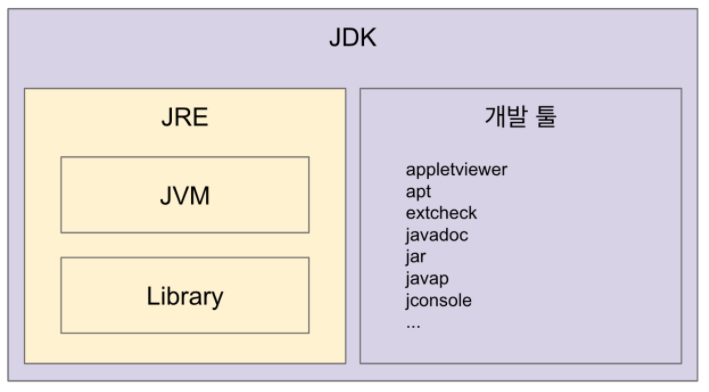
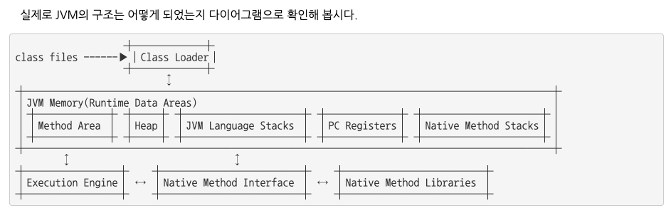

## JDK(Java Development Kit)

Java 개발 키트로, JVM, JRE와 개발을 위한 핵심 라이브러리를 가지고 있는 키트이다. JRE를 포함해 컴파일러, 디버거 등 개발 도구를 포함하고 있다.

참고로 Java 8 버전 이후의 JDK는 유료화가 되어, 보통의 자바개발 환경에 Java 8에 머무르고 있다고 한다.

> JDK의 구조는 다음과 같다.

## JRE (Java Runtime Environment)

JRE는 자바 구동 환경으로, 시스템 라이브러리와 JVM을 포함한다. 바이트코드로 컴파일된 자바를 실행하도록 하는 환경을 말한다. JVM 단독으로 설치할 수 없고, JRE가 JVM을 담고 있으며 JVM과 시스템 라이브러리를 이용해 컴파일된 자바 코드를 실행한다.

## JVM(Java Virtual Machine)

자바 어플리케이션을 클래스 로드를 통해 읽어들여, Java API와 함께 실행한다. 실제 자바 프로그램의 실행주체가 된다.
JVM은 물리적 머신과 별개의 가상 머신을 기반으로 자바를 작동시키기 때문에 어떤 하드웨어에서 작동을 시키든 실행코드를 변경하지 않고 동일하게 작동시킬 수 있다.

### JVM의 특징

- **스택 기반의 가상 머신**: 대표적인 컴퓨터 아키텍처인 인텔 x86 아키텍처나 ARM 아키텍처와 같은 하드웨어가 레지스터 기반으로 동작하는 데 비해 JVM은 스택 기반으로 동작한다.
- **심볼릭 레퍼런스**: 기본 자료형(primitive data type)을 제외한 모든 타입(클래스와 인터페이스)을 명시적인 메모리 주소 기반의 레퍼런스가 아니라 심볼릭 레퍼런스를 통해 참조한다.
- **가비지 컬렉션(garbage collection)**: 클래스 인스턴스는 사용자 코드에 의해 명시적으로 생성되고 가비지 컬렉션에 의해 자동으로 파괴된다.
- **기본 자료형을 명확하게 정의하여 플랫폼 독립성 보장**: C/C++ 등의 전통적인 언어는 플랫폼에 따라 int 형의 크기가 변한다. JVM은 기본 자료형을 명확하게 정의하여 호환성을 유지하고 플랫폼 독립성을 보장한다.
- **네트워크 바이트 오더(network byte order)**: 자바 클래스 파일은 네트워크 바이트 오더를 사용한다. 인텔 x86 아키텍처가 사용하는 리틀 엔디안이나, RISC 계열 아키텍처가 주로 사용하는 빅 엔디안 사이에서 플랫폼 독립성을 유지하려면 고정된 바이트 오더를 유지해야 하므로 네트워크 전송 시에 사용하는 바이트 오더인 네트워크 바이트 오더를 사용한다. 네트워크 바이트 오더는 빅 엔디안이다.

### JVM의 구조

크게 클래스 로더, Runtime Data Area, Execution Engine 3가지로 이루어져 있다.

> 클래스 로더

Runtime 시점에 클래스를 로딩하며, 클래스의 인스턴스를 생성하면 이 로더를 통해서 메모리에 로드해준다. 클래스는 참조되는 순간 동적으로 load와 link가 이루어진다고 한다. (Dynamic Loading)

 

> Runtime Data Area

JVM이 프로그램 실행을 위해 OS에 할당받은 메모리 공간. 크게 5가지 영역으로 나눌 수 있다.

### PC Register

Register Base가 아닌 Stack Base로 동작하고, 각 Thread 별로 하나씩 PC Register가 존재한다. 그리고 현재 수행중인 Java Virtual Machine Instruction 주소를 가지게 된다.  
Instruction의 주소는 Native Pointer일 수도 있고 Method ByteCode일 수 있는데, Native Method를 실행할 떄에는 JVM을 거치지 않고 바로 API를 통해 수행할 수 있다.

**Native Method**: 해당 OS 환경에서 제공하는 메서드 ? 다른 언어로 작성된 메서드?

### JVM Stack

Thread의 수행정보를 Frame을 통해서 저장한다. Thread가 시작될 때 생성되고, 다른 Thread가 접근할 수 없다. Method가 호출되면 Method와 Method 정보가 Stack에 쌓이고, 호출이 종료되면 Stack point에서 제거.  
각 스택 프레임은 Local Variable Array, Operand Stack, 현재 실행 중인 메서드가 속한 클래스의 Runtime Constant Pool에 대한 레퍼런스를 가짐.

- Local Variable Array(지역변수 배열) : 0부터 시작하는 인덱스를 가진 배열. 0은 메서드가 속한 클래스 인스턴스의 this 레퍼런스이고, 1부터는 메서드에 전달된 파라미터들이 저장되며, 메서드 파라미터 이후에는 메서드의 지역 변수들이 저장된다.

- Operand Stack(피연산자 스택) : 메서드의 실제 작업 공간. 각 메서드는 피연산자 스택과 지역 변수 배열 사이에서 데이터를 교환하고, 다른 메서드 호출 결과를 push하거나 pop한다. 피연산자 스택 공간이 얼마나 필요한지는 컴파일할 때 결정할 수 있으므로, 피연산자 스택의 크기도 컴파일 시에 결정된다.

### Native Method Stack

자바 외의 언어로 작성된 네이티브 코드를 위한 스택. JNI(Java Native Interface)를 통해 호출하는 C/C++ 등의 코드를 수행하기 위한 스택. 이렇게 공간을 분리하여 기존의 JVM 내부에 영향을 주지 않는다.

### Heap

인스턴스(객체)를 저장하는 공간. GC(Garbage Collection)의 대상이다. 성능 이슈를 일으키는 공간

### Method Area

JVM이 읽어들인 각각의 클래스와 인터페이스에 대한 Runtime Constant Pool. 필드와 메서드 정보, Static 변수, 메서드의 바이트 코드를 보관한다. 이 영역의 정보를 바탕으로 Heap 영역에 객체를 생성한다.  
 이 영역은 JVM 벤더마다 다양한 형태로 구현할 수 있다. 그리고 이에 대한 가비지 컬렉션은 JVM 벤더의 선택사항.

- Runtime Constant Pool  
  클래스 파일 포맷에서 constant_pool table에 해당하는 영역. 각 클래스와 인터페이스의 상수뿐만 아니라, 메서드와 필드에 대한 모든 레퍼런스까지 담고 있는 테이블. 즉, 어떤 메서드나 필드를 참조할 때 JVM은 런타임 상수 풀을 통해 해당 메서드나 필드의 실제 메모리상 주소를 찾아서 참조한다.
  (간단하게 말하기를, Method에 대한 영역은 Method Area, 클래스에 대한 영역은 JVM Stack, ??? (그냥 실제 실행 코드에 대한 데이터아닌감…) Instance에 대한 영역은 Heap이 된다.)

- Execution Engine  
  클래스 로더를 통해 JVM 내의 Runtime Data Area에 배치된 바이트 코드를 실행하는 주체. 자바 바이트 코드를 명령어 단위로 읽어서 실행한다.

 

---

 

`.class` 로 변환된 자바 바이트 코드는 완전한 기계어가 아니므로, 이를 인터프리트하는 과정이 필요하다.  
그 방식에는 2가지 방식이 있다.

- Interpreter : 바이트코드 명령어를 하나씩 읽어서 해석하고 실행한다. 하나씩 해석하고 실행하기 때문에 바이트코드 하나하나의 해석은 빠른 대신 인터프리팅 결과의 실행은 느리다는 단점을 가지고 있다. 흔히 얘기하는 인터프리터 언어의 단점을 그대로 가지는 것이다. 즉, 바이트코드라는 ‘언어’는 기본적으로 인터프리터 방식으로 동작한다.

- JIT(Just-In-Time) Compiler : 인터프리터의 단점을 보완하기 위해 도입된 것이 JIT 컴파일러이다. 인터프리터 방식으로 실행하다가 적절한 시점에 바이트코드 전체를 컴파일하여 네이티브 코드로 변경하고, 이후에는 해당 메서드를 더 이상 인터프리팅하지 않고 네이티브 코드로 직접 실행하는 방식이다. 네이티브 코드를 실행하는 것이 하나씩 인터프리팅하는 것보다 빠르고, 네이티브 코드는 캐시에 보관하기 때문에 한 번 컴파일된 코드는 계속 빠르게 수행되게 된다.

또한 이 Execution Engine이 GC도 가지고 있다.

- GC: 메모리 관리를 위한 방법 중 하나. Heap영역에 할당 했던 메모리 중에 필요없는 메모리를 해제하는 기능. Java GC는 객체가 garbage인지 판단하기 위해 **reachability** 개념을 사용하여 객체의 유효한 참조가 있다면 ‘reachable’ 로 없으면 ‘unreachable’ 로 구별하고, unreachable 객체를 Garbage로 간주하여 GC가 실행한다. 한 객체가 다른 객체를 참조하며, 다른 객체는 또다른 객체를 참조할 경우에는 유효한 최초의 참조가 무엇인기 파악해야 되는데, 이를 객체 참조의 **root set**이라고 한다.

Heap 영역에 있는 객체들에 대한 참조의 종류는 4가지이다.

1. Heap 내의 다른 객체에 의한 참조
2. JVM Stack, 즉 Java 메서드 실행 시에 사용하는 지역 변수와 파라미터들에 의한 참조
3. Native Stack, 즉 JNI(Java Native Interface)에 의해 생성된 객체에 대한 참조
4. Method Area의 static 변수에 의한 참조

이들 중 Heap 내의 다른 객체에 의한 참조를 제외한 나머지 3개(JVM Stack, Native Stack, Method Area)가 root set으로, reachability를 판가름하는 기준이 된다. 즉 root set으로부터 시작한 객체들은 reachable이며, root set과 무관한 객체들이 unreachable 객체로 GC의 대상이 된다.

## JAVA 컴파일 과정

1. 개발자들이 `.java` 파일을 생성한다.
2. Build 작업을 통해서 java 파일은 자바 컴파일러의 `javac` 라는 명령을 사용해 `.class` 파일을 생성한다. 이는 컴퓨터가 읽을 수 없는 **자바 바이트 코드**이다.
3. 이렇게 생성된 바이트 코드가 JVM 내로 클래스 로더에 의해서 로드되고, 실행 엔진에 의해 기계어로 해석되어 메모리 상(Runtime Data Area) 에 배치된다.

자바 컴파일의 세부 과정에 대해서는 이 포스팅을 참고해보자.  
[Back to the Essence - Java 컴파일에서 실행까지 - (1) - 뒤태지존의 끄적거림](https://homoefficio.github.io/2019/01/31/Back-to-the-Essence-Java-%EC%BB%B4%ED%8C%8C%EC%9D%BC%EC%97%90%EC%84%9C-%EC%8B%A4%ED%96%89%EA%B9%8C%EC%A7%80-1/)

## JAVA 코드 실행 과정

1. 제일 먼저 main() 함수를 찾는다. 있으면 클래스 로더가 실행을 시킨다.
2. Static 영역에 import한 패키지들과 프로그램의 모든 클래스, 필드, 메서드 올라간다.
3. stack 영역에 main()의 stack frame이 위치한다.
   -> 지역변수는 **초기화시** 위치, 클래스 선언을 제외한 메서드의 `{}, if의 {}`이 생길 때마다 Stack Frame이 생성
4. 메서드 실행
5. `}` 괄호를 만나면 Stack Frame이 사라지게 된다.
6. jre가 jvm을 종료시키고 위치했던 메모리들이 모두 없어진다.
7. 스택 프레임간에 는 데이터 접근이 불가능하지만, 내부의 스택 프레임은 외부의 스택프레임에 접근이 가능하다.

추가로 실행 관련해서 살펴보면 좋을 것 같다.  
[Back to the Essence - Java 컴파일에서 실행까지 - (2) - 뒤태지존의 끄적거림](https://homoefficio.github.io/2019/01/31/Back-to-the-Essence-Java-%EC%BB%B4%ED%8C%8C%EC%9D%BC%EC%97%90%EC%84%9C-%EC%8B%A4%ED%96%89%EA%B9%8C%EC%A7%80-2/)

## 멀티스레드와 멀티프로세스

### 멀티스레드

멀티스레드는 stack 영역(Method Area)을 스레드 개수만큼 분할

- Spring Framework는 클라이언트의 요청 만큼 스레드를 만든다.
- 공유영역(static , heap)에 있는 값들을 스레드별로 변경하려다 문제가 생길 수 있으니 주의해야한다.

### 멀티프로세스

멀티프로세스는 데이터 저장영역(Runtime Data Areas)을 프로세스 개수만큼 분할

- 공유영역에 있는 값들이 변할 위험이 줄어들어 안정성은 높아지지만, 그만큼 메모리 사용량이 늘어난다.

 

---

### 참고 포스팅

- [알기쉽게 정리한 JAVA의 컴파일과정 및 JVM 메모리 구조, JVM GC :: 알짜배기 프로그래머](https://aljjabaegi.tistory.com/387)
- [Java JVM / 자바 프로그램의 실행흐름 | Sehun Kim](https://sehun-kim.github.io/sehun/JVM/)
- [자바 JVM 정리(Java Virtual Machine) :: JDM’s Blog](https://jdm.kr/blog/188)
- [<더 자바 JVM 이해하기](https://dailyheumsi.tistory.com/196)
- [펌JVM > Classloader JVM과 Class Loader의 이해 및 로드타임 동적 로딩과 런타임 동적 로딩의 이해 : 네이버 블로그](http://blog.naver.com/PostView.nhn?blogId=choigohot&logNo=40192701035)
