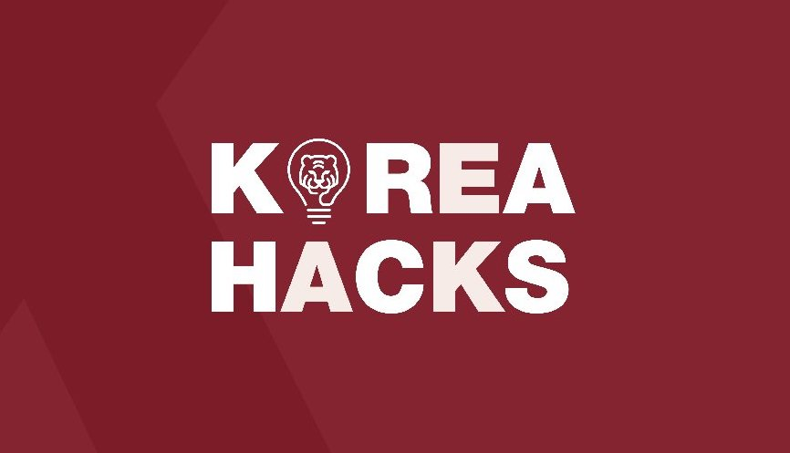
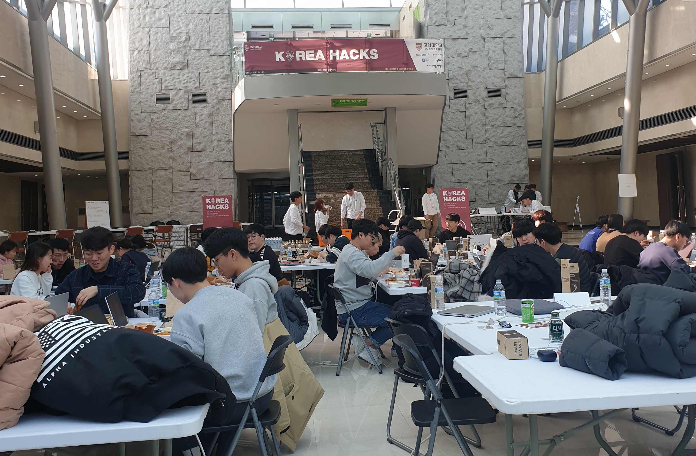
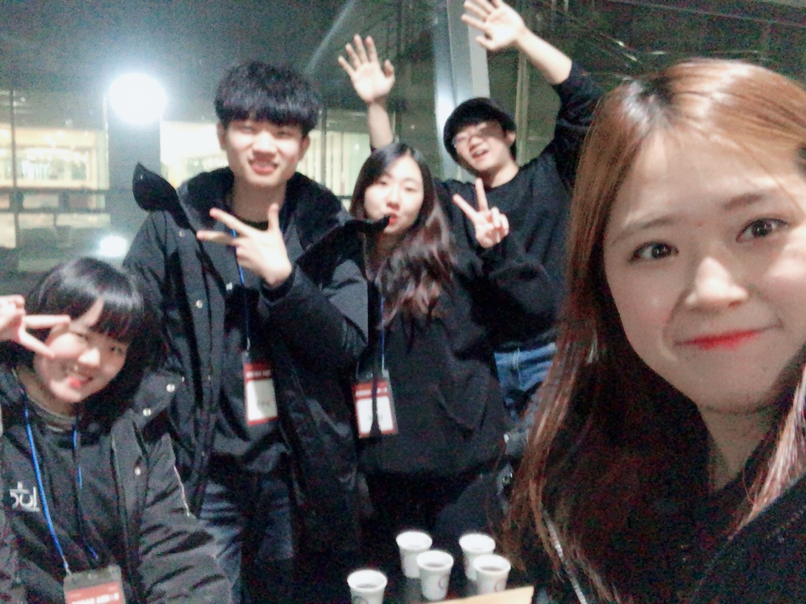
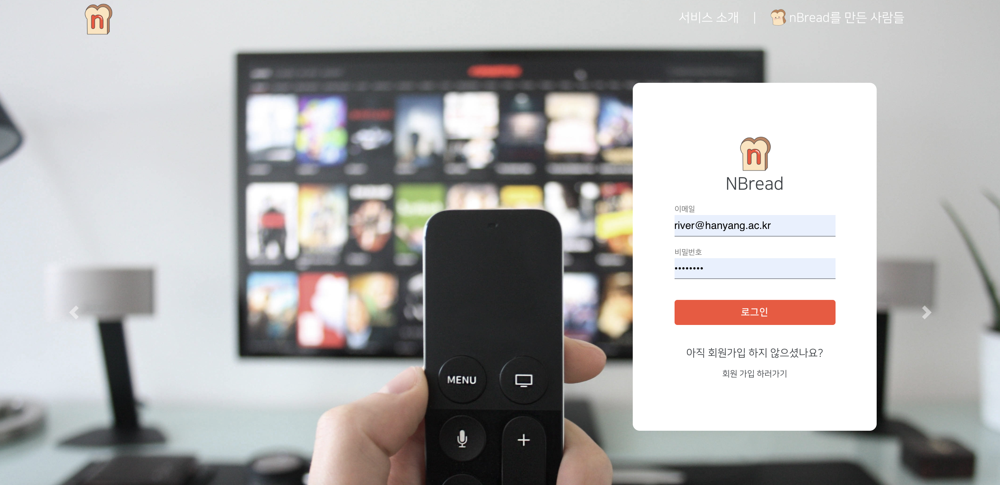
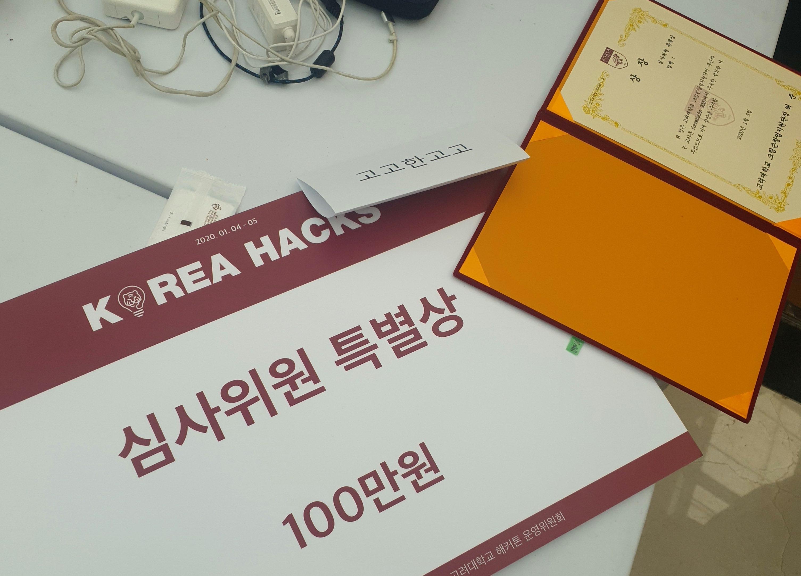

## 야 해커톤 나갈래?

이 해커톤은 처음 친오빠가 나에게 보냈던 이 카톡으로 시작되었다.

이 때 당시에는 인턴 6개월을 끝내고 1개월간의 쉴 수 있는 시간이 주어질 예정이었던 터라  
어차피 계절학기만 들을건데... 해커톤 나가볼까? 하고 가볍게 생각했다.

처음 본 친오빠의 지인들과의 해커톤. 여태 한번도 본 적 없는 새로운 사람들과의 해커톤이 어떨까 궁금해하면서 준비를 시작했던 것 같다.

해커톤을 하기 전 팀원들과 3번 정도의 만남을 가졌고 어떤 아이디어, 스택, 역할로 개발을 할지 정했고, 해커톤 날이 되었다.

## Korea Hacks

그렇게 1월 4일에 시작한 고카톤!

사실 간 날 전 날 부터 머리가 계속 아파서 병원 들러서 약을 타고 조금 늦게 참가했다ㅜㅜ  
근데 신기한 것은 가서 코딩하는 순간부터 머리가 안 아프더라 :eyes:

지금 돌아보면 거의 12시간 동안은 밥도 제대로 안먹고 미친듯이 코딩만 한 것 같다ㅋㅋㅋ  
우리가 생각했던 아이디어가 쳐야 될 feature들이 굉장히 많았어서  
거의 숨을 쉬는 것과 같이 코드를 치지 않으면 우리가 생각한 만큼 구현할 수 없었다.

그래서 정말 팀원들과 열심히 코딩만 했다.

점심을 가져오면서 다른 사람들을 살짝 둘러봤는데 이미 디자인도 모두 짜 온 팀들도 많아서 처음엔 오오... 매우 위축됐었다.
그래도 어떡하겠어! 열심히 해야지! :fire:

 

 

해커톤이 진행되는 도중에 따로 초청된 멘토분들이 돌아다니면서 참가자들의 아이디어도 물어보고,
어려운 것이 있을 때 조언과 아이디어를 주기도 하셨다.

자랑아닌 자랑이지만, 우리 팀은 해커톤 주제와 관련해서 스펙 문서, convention 문서 정리를 Notion에 열심히 해놨었는데, 많은 멘토분들이 이 부분에 대해서 매우 칭찬해주고 가셨다.

지금도 기억나는 멘토분은 스캐터랩에서 오신 멘토분이었는데, 진행 정도를 여쭤보시면서  
`아니 커밋 메시지 컨벤션도 있어요?` `무슨 초기 스타트업 보는 것 같아요!`  
하면서 엄청난 텐션으로 반응해주셔서 매우 인상깊었다.

이번년도 파이콘에서 스캐터랩 CTO분을 뵌 적이 있었는데 그 분과 텐션이 매우 비슷해서 같은 기업에 있으셔서 느낌이 비슷한건가 라는 생각도 들었다.

 

 

야식을 먹고 나서 12시쯤을 지나니... 이때부터 살짝 개발력이 떨어지기 시작했고  
백엔드 쪽 User 부분을 맡았던 나는 Cookie 설정 때문에 미친듯이 끙끙대다가 결국 나가떨어지기 시작했다.
User authentication 부분 경험이 없다보니까 매우 삽질을 많이 했다.  
CORS 설정을 당최 어떻게 해야할지... 한 3시간은 싸맨 것 같다.

그리고 해커톤 장소가 유리벽으로 되어 있어서 너무 추웠고  
와 이거 3시까지 있어야 하는데 어떻게 버티나 하는 걱정도 들었다.

결국 한 4~5시까지 고민하다가 잠에 들었고 7시 반쯤에 다시 일어나서 마무리 작업을 했다.  
신기하게도 그렇게 고민했던 cookie 문제 + 우리가 가장 구현 해야하는 priority별 filter API 작업이 한 시간 안에 빠르게 되었다.
(물론 개발 끝내고 시연 부스 진행 목전까지 계속 코드를 만지고 있긴 했지만.. :cry:)

 
 

**그렇게 완성된 우리 페이지!**

각 팀별로 부스를 이뤄서 하루동안 개발한 것을 시연했는데, 정말 짧은 시간에 다들 좋은 아이디어와 실력으로 많은 것을 구현한 것 같다.  
심사위원분들도 돌아다니면서 여러 팀들을 구경하셨는데, 한 교수님께서 우리 서비스를 보고 명함을 주고 가셨다... :open_mouth:

그리고 네이버에서 온 심사위원 분께서는 우리 서비스를 보고 실 서비스로 우리 서비스를 올렸을 때 일어날 수 있는 트래픽 이슈에 관련해서 질문을 던져 주셨다.  
네이버에서 예약 부분을 담당하고 있는 개발자 분이셔서 그런 부분에 있어서 좋은 insight를 받은 것 같았다.

## 해커톤 그 결과는..

결과적으로 우리 팀은 **심사위원 특별상**을 수상하였다!! :raised_hands:  
팀원 모두 쉴새 없이 24시간 동안 고생해서 코딩했던 터라 + 팀 분위기도 너무 좋았어서 협업상 정도는 받을 수 있지 않을까 생각했었는데, 더 큰 상을 받게 되어서 조금은 얼떨떨했다.

물론 상을 받은 것도 매우 매우 좋았지만, 나에게 이 해커톤이 값졌던 이유는 좋은 사람들과 너무 바람직한(?) 모습으로 개발을 할 기회가 있었기 때문이 아니었을까 싶다.

처음 만나서 회의를 하면서 우리가 가장 먼저 이야기 했던 부분들은 각자 `해보고 싶은 것`, 각자가 `잘 할 수 있는 것`들이 무엇인지였다.
이런 것들을 먼저 얘기하고 여러가지를 정하니 이 해커톤 자체가 단순히 상을 얻기 위해서가 아니라, 나 스스로 `도전 해 보는 것`이 되니까 해커톤에서 더 재밌게 개발할 수 있었던 것 같다.

내가 이 해커톤에서 해보고 싶다고 했던 것들을 생각해보았을 때, `typescript 써보기`, `User 부분 담당해서 코딩하기`였는데, 그것들을 이번 해커톤에서 모두 해볼 수 있어서 매우 좋았다.

또한, 해커톤의 여러가지 부분에서 **Rule**을 정하는 것을 중요하게 여겼던 것도 우리가 성공적으로 해커톤을 끝마칠 수 있었던 이유인 것 같다.  
우리가 생각한 아이디어에 대한 스펙들, 스케폴딩 구조, branch와 commit convention, 환경변수 관리, API docs 등 개발하면서 필요한 것들에 대해서 룰을 정하고 이런 것들을 꾸준하게 문서화했다.  
이런 기반들 덕분에 우리가 실제로 해커톤에서 개발을 하는 속도를 많이 높여주었고, 각자가 개발한 브랜치를 마스터에 머지할 때도 충돌도 거의 나지 않았다.

이런 것들이 중요하다는 것에 대해서는 인턴 경험을 통해서 알고 있긴 했지만, 그것을 공감해주고 같이 룰을 만들어 줬던 (특히 서비스 구조 init은 오빠가 고생을 많이했다 :pray:) 팀원들에게 매우 감사하고, 정말 이렇게 잘 맞는 사람들을 만날 수 있어서 감사하다는 생각을 한다.

 
 

이번 해커톤을 경험하면서, 또 이렇게 좋은 사람들과 치열하게 코딩을 할 기회를 가지는 것을 이번년도 목표로 정했다.
좋은 사람들과 즐겁게 고민하며 코딩했던 고카톤에서의 기억을 잊지 않고, 또 다른 해커톤에 도전 할 수 있는 좋은 기회를 만들 수 있기를 바라며 글을 마친다.
