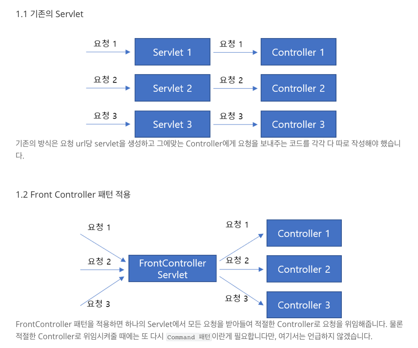
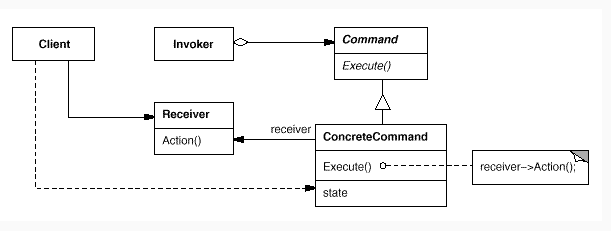

## 스프링 (프레임워크)

자바 플랫폼을 위한 오픈소스 어플리케이션. 정확히는 **스프링 프레임워크**라고 하는 것이 맞다.
의존성을 주입해주는 컨테이너를 제공해주는 라이브러리이다.

### 스프링 코어

다른 스트링 관련 모듈 (Spring-MVC, Sping-JDBC)들이 공통으로 사용하는 라이브러리.

### 스프링 MVC

Front Controller 패턴에 Spring의 의존성 주입을 이용해 컴포넌트들의 생명주기를 관리할 수 있는 컨트롤러 중심의 웹 MVC 프레임워크
여기에 dispatch servlet, View resolver, interceptorAdapter와 같은 기본 MVC 구조를 위한 클래스들을 제공해준다. 그에 맞추어서 상속받아 구현해주면 된다.



Front Controller 패턴이 위와 같고,
Command 패턴을 이용하여 Front Controller 패턴을 구현할 수 있다.

[커맨드 패턴 (Command Pattern) - 기계인간 John Grib](https://johngrib.github.io/wiki/command-pattern/)

그리고 DispatcherServlet은 저렇게 Front Controller 패턴을 이용해서 구현되었다.

### 스프링 부트

스프링 프레임워크로 개발하기 위해서는 Spring-Context에서 제공하는 DI외에도 MVC, JDBC, Security 등 다양한 모듈 설정을 적용한 후에 사용해야한다.
이런 것들이 모두 설정되어있는 것이 바로 스트링 부트이다.

서블렛 설정이나 톰캣 설치를 하지 않아도 내부에 있는 WAS를 이용해서 돌릴 수 있다.

### Thymleaf

스프링 프레임워크 뷰 템플릿 엔진

## WAS(Web Application Server)

HTML과 같은 정적 파일을 서빙해주는 역할을 하는 서버를 **웹서버**라고 하고,
PHP, JSP, ASP와 같은 언어들로 동적인 페이지를 생성 가능한 서버를 **웹 어플리케이션 서버**라고 한다.
자바 계열에서는 웹 어플리케이션 컨테이너라고 하며, WAS라고 줄여 부르기도 한다.

## JSP

자바 서버 페이지.
html에 자바 코드를 넣어서 동적으로 페이지 렌더링을 가능하게 만들어주는 웹어플리케이션 도구. 서버사이드에서 JSP 파일을 가지고 동적으로 값을 넣어서 Client들에게 전송한다.

## JAR / WAR

둘다 java의 jar 툴을 이용해 생성된 압축 파일이다.
어플리케이션을 쉽게 배포, 동작 시킬 수 있도록 관련 파일들을 패키징해준다.

JAR(Java Archive)는 java 리소스, 속성파일, 라이브러리 및 액세서리 파일들이 포함되어 있다. 즉, **자바 프로젝트를 압축한 파일**. 윈도우 집파일이랑 다를바가 없다.

WAR(Web Archive)는 servlet / tsp 컨테이너에 배치할 수 있는 **웹 어플리케이션** 압축 파일 포맷이다. JSP, Servlet, Jar, Class, Xml, Html, Javascript 등 서블렛 콘텍스트 관련 파일들로 패키징되어있다. 웹 관련 자원만 포함하고 있고, 이를 사용하면 쉽게 웹 어플리케이션을 배포할 수 있다.

WAS는 web app 자체 API를 제공하기 위해 컨테이너를 로드하는 클래스로더와 사용자가 추가한 JSP나 WAR 파일을 다루기 위한 ServletContext Loader를 사용한다.

## 서블릿

서버쪽에서 실행되며, 클라이언트의 요청에 따라 동적으로 서비스를 제공하는 자바 클래스.  
JSP/Servlet 컨테이너 = Tomcat과 같은 웹 어플리케이션 컨테이너에서만 실행된다.

자바에서 HTTP 요청과 응답을 처리하기 위한 내용들을 담고 있다.

## 생명주기

자신만의 생명주기를 가지고 있는데, WAS에서 콘텍스트가 초기화되면 생명주기가 시작된다.

Initialize: 로드한 서블릿의 인스턴스를 생성하고, 리소스를 로드하는 등 클래스 생성자의 초기화 작업과 동일한 역할을 수행한다.

Service: 클라이언트의 요청에 따라 호출할 메서드를 결정한다.

destroy: 서블릿이 언로드 된다. 런타임 오류가 발생하거나 서블릿 컨테이너가 종료되었을 때 발생하는데, 이 떄 서블릿이 언로드 되어 메서드 호출 결과가 정상적으로 표출되지 않는다.

## 자바빈

자바의 내부의 일반 객체

Spring 진영에서는 POJO라는 다른 말을 쓰게 되었다.
원래는 EJB (엔터프라이즈 자바빈) 이라는 말이 있었음.

이를 스프링 내부에서 사용할 수 있도록 등록할 수 있는데, 방법이 2가지가 있다.

1. xml : applicationContext.xml -> 이렇게 파일을 만들어서 등록
2. 어노테이션

이렇게 만들어주면 인스턴스 생성을 스프링에게 위임할 수 있다.
다른 클래스 또는 인터페이스를 멤버 변수로 가지고 있는 경우는 property를 이용해서 명시할 수 있다.

이러한 자바 빈은 스프링 프레임워크가 돌아가고 있을 때 내부에서 클래스 로더에 생성되어있는 객체를 말한다.

## Hibernate

JPA를 사용하기 위해 JPA를 구현한, ORM 프레임워크 중 하나라고 한다.
데이터 유효성 검사를 위한 어노테이션도 제공해준다.

## IoC

: Inversion of Control (제어의 역전)
Spring은 프로그램의 생명주기에 대한 주도권이 WebApp Container에 있다.
servlet을 이용해 그를 init하고 service 및 destroy하는 과정을 전부 WAS가 관리해준다.

## 의존 관계 역전 원칙

- 하이레벨 모듈은 로우레벨 모듈에 의존해서는 안되고, 모두 인터페이스에 의존해야한다.
- 추상화는 세부사항에 의존해서는 안된다. : 인터페이스를 활용해 결합도를 낮추자.

하지만, 자바는 객체 생성을 위한 코드가 수반됨 -> 인스턴스화 할 수 있는 코드에 대한 의존성이 생김.

## 의존성 주입

저런 인스턴스화하는 코드에 대한 의존성을 주입함으로서 의존관계가 역전될 수 있다.

## 스프링 부트 자동 구성

: 스프링 구성을 적용해야할지 말지를 결정하는 요인들을 판단하는 런타임 (어플리케이션이 시작되는 시점) 과정.
Ex) 클래스패스에 Thymeleaf가 있다면 Thymeleaf 템플릿 리졸버, 뷰 리졸버, 템플릿 엔진을 구성하는 것. 사용하고 있는 것에 따라서 스프링을 알아서 구성해준다.

다음 두가지의 스프링 기법을 기반으로 자동 구성을 한다.

- 자동 연결(autowiring)
- 컴포넌트 검색(component scanning)

## 부트스트랩 클래스

: Jar 파일에서 어플리케이션을 실행하므로 제일 먼저 시작되는 클래스. 그리고 최소한의 스프링 구성도 있어야 함. 그걸 main에서 해줌.

## @SpringBootApplication

- @SpringBootConfiguration : 현재 클래스를 구성 클래스로 지정
- @EnableAutoConfiguration : 스트링 부트 자동구성을 활성화. 우리가 필요로 하는 컴포넌트들을 자동 구성
- @ComponentScan : 컴포넌트 검색을 활성화한다. @Componenet, @Controller, @Service 등의 어노테이션과 함께 클래스를 선언할 수 있게 해준다. 이런 클래스를 스프링 어플리케이션 컨택스트에 컴포넌트로 등록한다.

## Lombok

: 런타임에 자동으로 메서드 생성  
누락된 final 속성 초기화, getter setter 만들어줌 등등 정말 다양한 어노테이션을 제공해준다.
